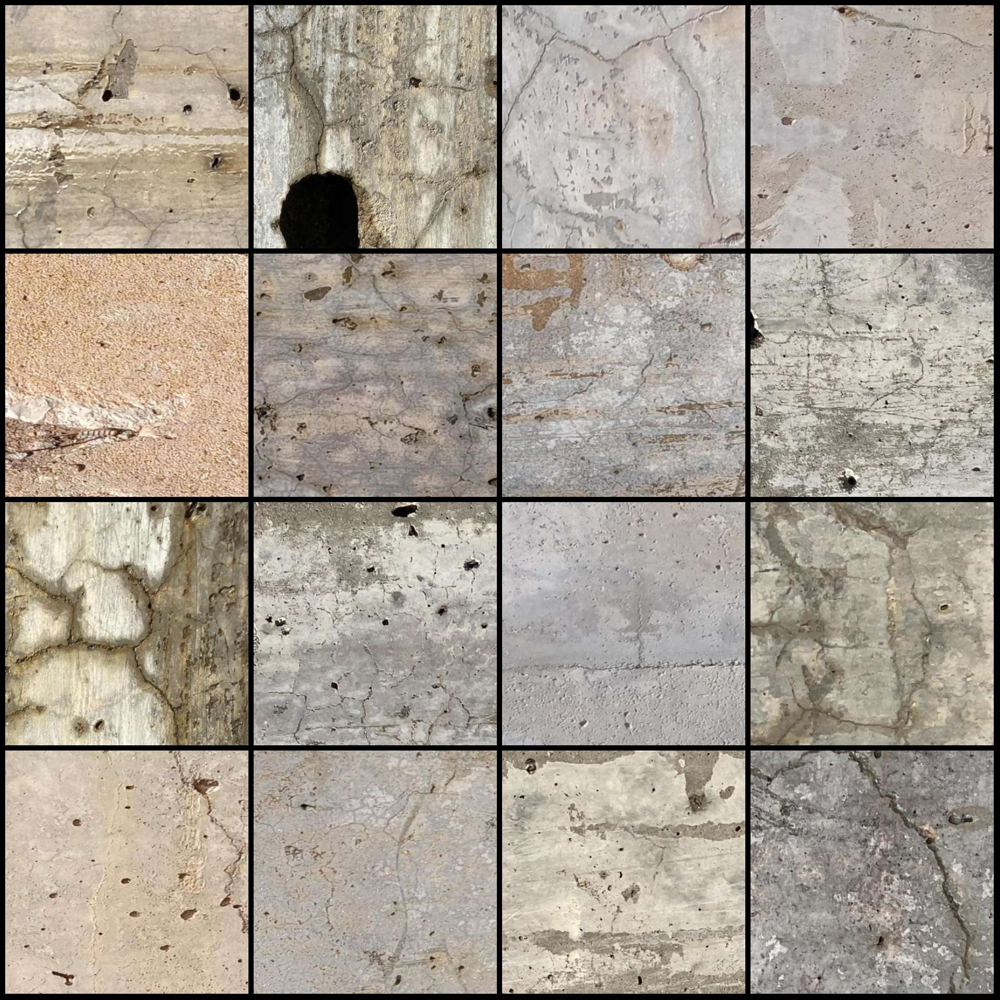
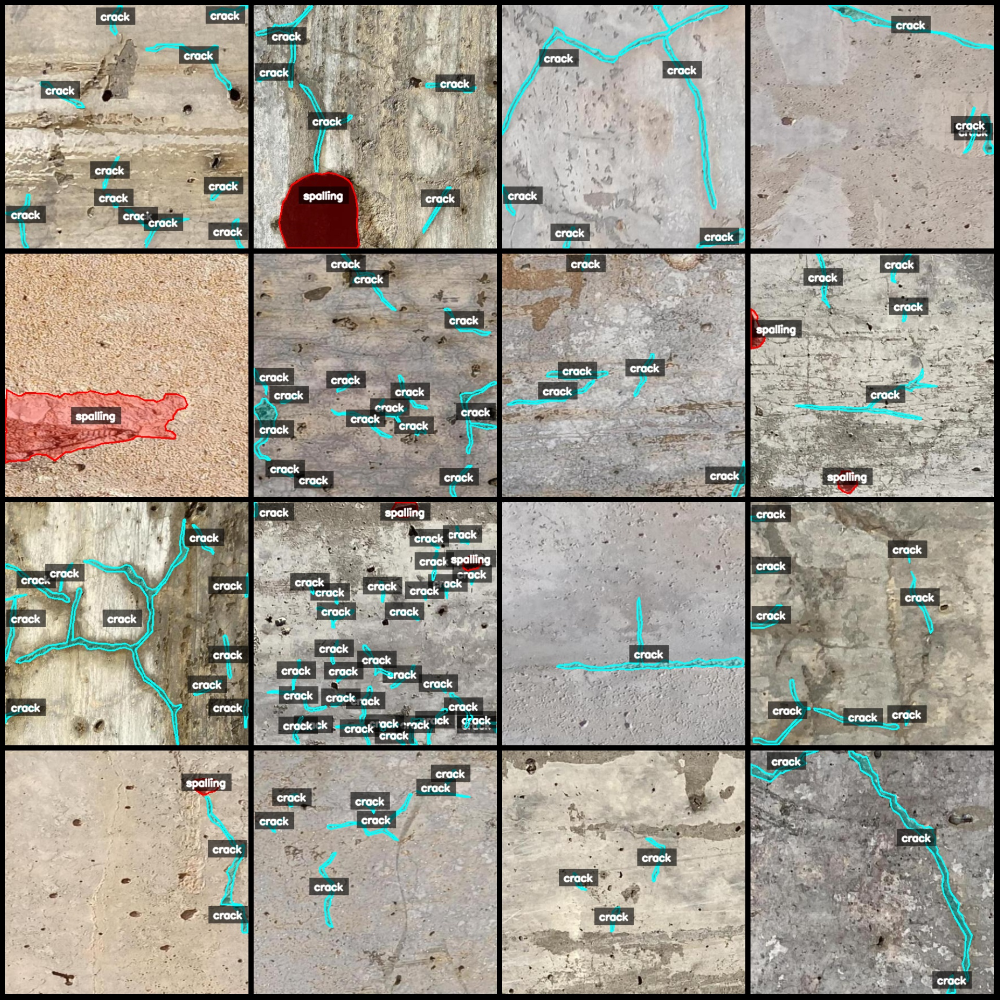
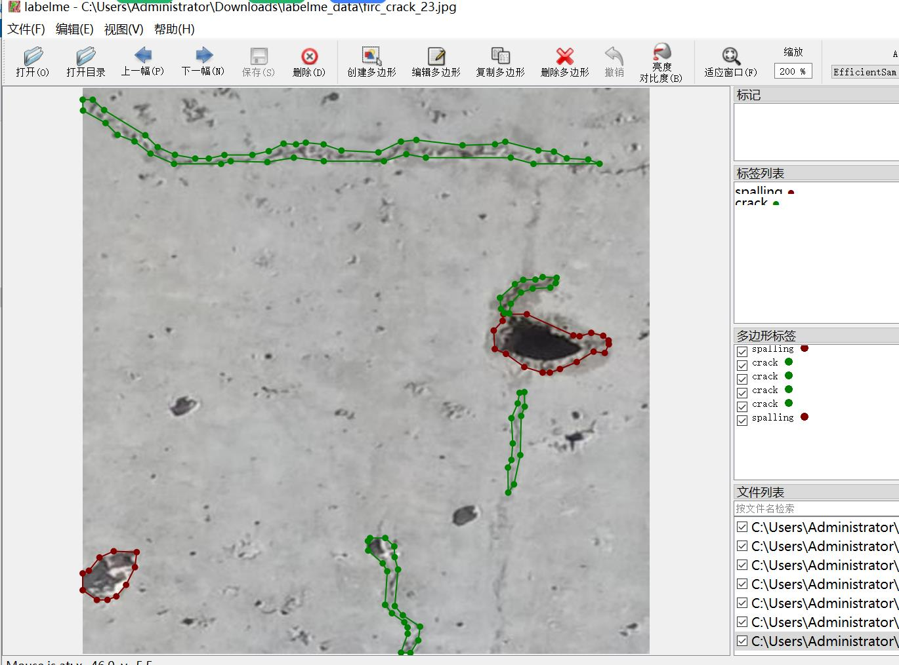

# Concrete Wall Cracks and Peeling Segmentation Dataset - LabelMe Format

## Dataset Description
The dataset consists of 1497 labeled images in the labelme format, with two categories: "spalling" (cracks) and "crack". The images are 432x432 resolution and contain only JPG files.

### Image Details
- Number of JPG files: 1497
- Number of JSON files: 1497
- Number of categories: 2
- Category names: ["spalling", "crack"]
- Box counts for each category:
  - Spalling (Cracks): 481 boxes
  - Crack (Crown): 19229 boxes
- Total number of boxes: 19710

### Data Preparation Tool
- Labelme version: 5.5.0

### Image Resolution
- Resolution: 432x432

### Annotation Rules
- Polygons are drawn around the categories.

### Special Notes
- This dataset can be opened and edited using LabelMe. However, the JSON dataset should be converted to either Yolo or Mask format for semantic segmentation or instance segmentation.
- No guarantee is made regarding the accuracy of the trained models or weights files.

### Preview of Images
- Please refer to the attached images for a preview of the labeled examples.

---

#### Example of Annotation
- **Randomly selected 16 images**:


...


#### Annotation Results
- The actual results of the annotation will depend on the annotation tool used. For example, the following image shows a sample annotation in LabelMe:

```plaintext
[{'label': 'spalling', 'confidence': 0.999, 'class_id': 'spalling'}, {'label': 'crack', 'confidence': 0.999, 'class_id': 'crack'}]
```

#### Example of Editing in LabelMe
To edit the images using LabelMe, follow these steps:
1. Open the dataset in LabelMe.
2. Right-click on an image and select "Edit".
3. Add your own labels and adjust the confidence level as needed.
4. Save the changes by clicking "Save Changes".

## Images






Here is a pay link on Stripe ( https://buy.stripe.com/3cs8yP7sY87d0vu9AB ). Please contact me lonlonago@foxmail.com after funding $89, and I will send you a complete data files , thank you!


